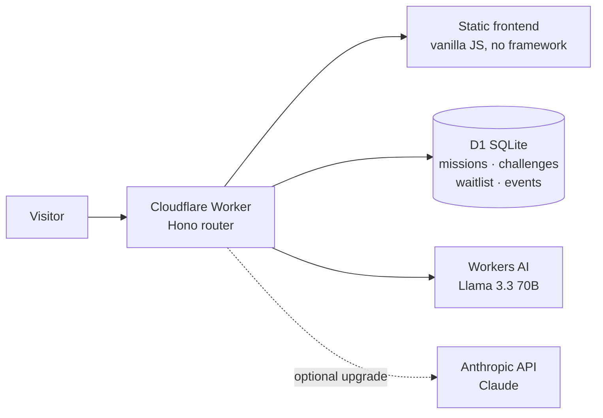

# The Five-Minute Win

**One real-life win with AI. Five minutes here. A win out there.**

Live at **[fiveminutewin.com](https://fiveminutewin.com)**

The Five-Minute Win teaches non-technical people to use AI by *never teaching them* — instead, every day it hands them one small real-life mission (send the email you've been avoiding, script the call that lowers your bill, turn your fridge into a week of dinners) and lets them finish it with AI, on the page, in five minutes. The lesson is the application. Users leave with something done, not something learned-and-forgotten.

Built solo (with AI pair-programming), from concept to production, on a total infrastructure budget of ~$0/month.

## Product design highlights

- **The lesson is the application.** No articles, no videos. Each daily mission is a real task completed today, with a copy-ready prompt and a plain-language "why this works" that teaches exactly one transferable skill.
- **One lesson, five lives.** Every mission is written five times — for a shop owner, a parent, an office worker, a job-seeker, and a retiree. Switching persona rewrites the entire mission: story, prompt, and reasoning. Personalization as pedagogy.
- **A quiz nobody calls a quiz.** The daily challenge is a Wordle-style duel: two prompts, guess which produced the better result, learn the tell. Four rounds, rising difficulty, shareable emoji scorecard.
- **An honest promise.** "Five minutes" is precisely scoped: five minutes *on the site* gets you armed; the win happens in your life, on your clock. The UI structurally separates "the five minutes" from "your move."
- **Guided helper, not open chat.** "My Problem" lets users bring their own task: the AI interviews them (max three questions), delivers the result, then shows *the one reusable prompt that would have done it in one go* — every help session ends as a lesson.
- **The curriculum has a hidden arc.** Seven launch missions teach seven compounding habits (state your tone → bring your facts → hand over mess → rehearse → let AI interview you → paste documents safely → steer brainstorms). Day 7's challenge silently re-tests Day 1's hardest lesson.
- **Privacy as curriculum.** Day 6 teaches stripping personal identifiers before pasting documents into any AI — enforced in the product's own helper, which refuses to want them.

## Architecture

Zero-cost, globally distributed, one vendor:



- **Cloudflare Workers + Hono** — API and static serving from 300+ edge locations, no cold starts
- **D1 (SQLite)** — missions, challenge rounds, waitlist, privacy-hashed usage caps, lightweight analytics events
- **Workers AI** (Llama 3.3 70B) for in-page generation, with an engine-chain fallback to the Anthropic API when a key is configured — swapping the model behind the product is one env var
- **Content as code** — the entire curriculum lives in [`db/content-pack.md`](db/content-pack.md), a human-readable markdown file; [`scripts/build-seed.mjs`](scripts/build-seed.mjs) parses it into the database seed with hard validation (7 missions × 5 personas × 4 challenge rounds, or the build fails). Writing a new mission is editing prose, not SQL.

## Cost engineering

The product serves live LLM generations to anonymous users for free, safely:

1. Per-visitor daily cap (visitors identified by salted SHA-256 hash — raw IPs are never stored)
2. Conversation length and input size limits on the helper endpoint
3. Workers AI free daily allocation covers launch-scale usage; overflow is ~$0.011 per thousand neurons
4. Every failure path degrades to the always-free copy-paste prompt — the user is never dead-ended

Result: realistic worst-case spend is bounded and single-digit dollars; typical month is $0.

## Repository tour

| Path | What it is |
|---|---|
| `src/index.js` | The entire backend: missions API, capped AI generation with engine chain, guided-helper endpoint with interviewer system prompt, waitlist, analytics |
| `public/index.html` | The entire frontend: single file, no framework, mobile-first with bottom tab navigation |
| `db/content-pack.md` | The launch curriculum — 7 missions × 5 personas + 28 challenge rounds, human-readable |
| `db/schema.sql` / `db/seed.sql` | Database schema and generated seed |
| `scripts/build-seed.mjs` | Markdown → database compiler with validation |
| `docs/` | Original planning artifacts: project brief and implementation plan (the project began under the working title "The Daily Win"; renamed after a trademark-collision check) |
| `design/prototype-v2.html` | The clickable design prototype that preceded the build — iterated through three independent AI design reviews before a line of production code |
| `.github/workflows/deploy.yml` | Push-to-deploy via GitHub Actions |

## Run it locally

```bash
npm install
npx wrangler d1 execute fmw --local --file=db/schema.sql
npx wrangler d1 execute fmw --local --file=db/seed.sql
npx wrangler dev
```

## Deploy

Push to `main` (GitHub Actions deploys via Wrangler, using the `CLOUDFLARE_API_TOKEN` repository secret), or run `npx wrangler deploy`. Secrets (`VISITOR_SALT`, optional `ANTHROPIC_API_KEY`) are set via `wrangler secret put` and never committed.

## Roadmap

Magic-link accounts and the daily mission email (Resend) · founding-member program → payments once the waitlist proves demand · member "Life Portfolio" with persona-fitted proof (shareable portfolio link, printable badge, milestone pages) · mission-rehearsal mini-chat · analytics-driven persona and mission expansion.

---

© 2026 Ben (mutahbn). All rights reserved. Source shared for review and portfolio purposes — see [LICENSE](LICENSE).
